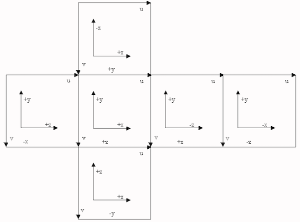
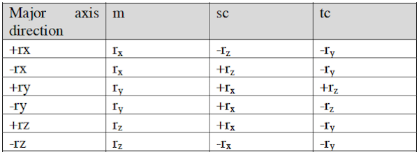
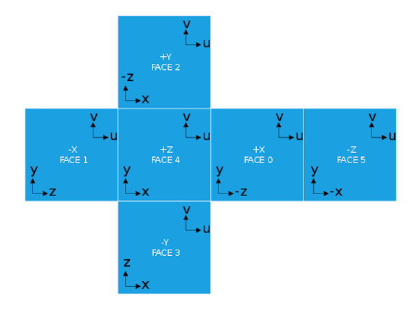

This project consists of 5 Demos all giving the same output: a 4:3 horizontal cross cubemap.

Rationale: Many shaders posted on the Internet are written in GLSL. The NDC systems, view port coordinate systems and texture coordinate systems of OpenGL and Metal are different. However, cubemaps must follow the Renderman specifications.



<br />
<br />
<br />

**Demo 1: Crossmap.** 

This demo shows how to load six 8-bit or 16-bit color images. Currently only 16-bit .hdr images are supported and they are loaded using an external C-header library available widely on the Internet. This library can also load .png and .jpg images but this demo uses the built-in MTKTextureLoader functions to accomplish the task. The MTKTextureLoader function 

```swift

        newTextures(URLs, options:, error:)
```

can load images via a list of URLs and return an array of MTLTextures.


The following MTLTextureDescriptor class function is then  called

```swift
        textureCubeDescriptor(pixelFormat:, size:, mipmapped:)
```

to create a 3D cube MTLTextureDescriptor object which is passed on to the  MTLDevice method

```swift
        makeTexture(descriptor:)
```

which will allocate a texture object with privately owned storage.

We need to setup and configure an instance of MTLRenderPassDescriptor which is used to render a cubemap using layer rendering. Next, an instance of MTLRenderPipelineState must be created and configured for layer rendering.

When all the various states are configured, the initializer of the class CubemapRenderer calls a renderer to capture the cubemap texture . Once the cubemap texture is created, it is passed to a kernel function to output a horizontal (4:3) cubic crossmap

The 6 squares of the resulting horizontal cubic crossmap has the following texture coordinates.

 texture coordinates of the 4 corners.


```


| face  |   top left   |   top right  | bottom right |  bottom left |
|   +X  | (0.50,0.333) | (0.75,0.333) | (0.75,0.667) | (0.50,0.667) |
|   -X  | (0.00,0.333) | (0.25,0.333) | (0.25,0.667) | (0.00,0.667) |
|   +Y  | (0.25,0.000) | (0.50,0.000) | (0.50,0.333) | (0.25,0.333) |
|   -Y  | (0.25,0.667) | (0.50,0.667) | (0.50,1.000) | (0.25,1.000) |
|   +Z  | (0.25,0.333) | (0.50,0.333) | (0.50,0.667) | (0.25,0.667) |
|   -Z  | (0.75,0.333) | (1.00,0.333) | (1.00,0.667) | (0.75,0.667) |


```

The kernel function (named compute) will transform the texture coordinates of each face of the crossmap to a direction vector which is used to access the correct face of the cubemap texture. The table above will be useful when it comes to understanding the algorithm adopted by the kernel function.  
(Hint: 0.25 = 1/4, 0.50 = 1/2, 0.75 = 3/4, 0.333 = 1/3 and 0.667 = 2/3)

The following table shows the mapping of textures coordinates to positions of the six 2D faces of the cubemap.




There is a bug when compiled and run under macOS 10.13.x. The colour of four of the faces (+X, -X, +Z, -Z) might not be correct if the images are of type .png. The colorPixelFormat of the instance of MTKView is MTLPixelFormatRGBA16Float. One possible solution is to pass the 6 MTLTextures to a kernel function to convert the 8-bit colours to 16-bit (half) floats before instantiating the textureCube descriptor.

Possible bug: a thin vertical white line is displayed; it is probably to rounding errors. To work around this, minor modifications to the original shader code are made.

<br />
<br />
<br />

**Demo 2: Crossmap2**

Instead of using a kernel function, a pair of vertex-fragment shader functions is used. A kernel function can compute the colours of a small rectangular grid of pixels in parallel. When a  pair of vertex-fragment functions is used, the fragment function is called whenever the colour of each pixel needs to be computed.


<br />
<br />
<br />

**Demo 3: Crossmap3**

This is a modification of Demo2. XCode has an option called "New Cube Texture Set" which allows the six 2D images to be stored in the application's Assets.xcassets folder. The MTKTextureLoader class has a function:

        newTexture(name, scaleFactor, bundle:, options:)

which can be used to load and create an instance of MTLTexture of type MTLTextureTypeCube. HDR files cannot be dropped into the Assets.xcassets folder; XCode only accepts a small number of graphic images e.g. png, jpg etc. Xcode will compress images in the Assets.xcassets folder  into a file named "Assets.car".

Furthermore, the textures of the six faces of the cubemap are vertically flipped when passed to the fragment function.


**Demo 4 & 5: OGL-Crossmaps**

The OpenGL and OpenGL-ES versions of Crossmap. The major part of the code was ported from Apple's "MigratingOpenGLCodeToMetal" project. The requirements for these 2 applications are set to run on macOS 10.12.x or later, Swift 3.0 or later.

The GLSL shaders are tested with OpenGL 3.2 or later and OpenGL ES 3.0.

OpenGL's texture coordinate system has its origin at the bottom left with the u-axis from left to right horizontally and the v-axis vertically up.  This texture coordinate system is different from the Renderman standard. To calculate the direction to a face of the cubemap, the figure below can be used as a guide.




**Requirements:** XCode 9.x, Swift 4.x and macOS 10.13.4 or later.
<br />
<br />

**References:**


https://cgvr.cs.uni-bremen.de/teaching/cg_literatur/Cube_map_tutorial/cube_map.html


https://www.shadertoy.com/view/tdjXDt


https://en.wikipedia.org/wiki/Cube_mapping

